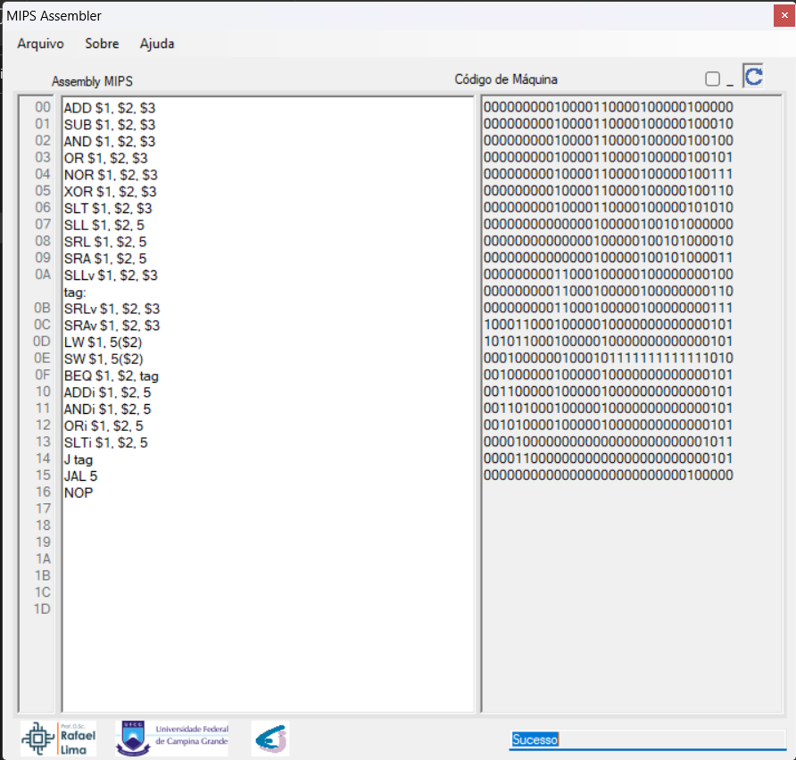

# MIPSA
Simple MIPS Assembler

Esse aplicativo foi desenvolvido para auxiliar as atividades da disciplina Lab. de Arquitetura de Sistemas Digitais, do curso de Engenharia Elétrica da Universidade Federal de Campina Grande - UFCG.

É um software assemblador que gera código de máquina para o processador MIPS desenvolvido por cada um dos alunos em Verilog/Systemverilog. Esses processadores têm 8 registradores de 8bits, 1kbyte de memória de instruções, 256bytes de memória de dados e uma ULA com 6 operações. Mais detalhes na seguinte playlist: https://youtube.com/playlist?list=PLKM6TRQ8YHKdxnB_G8raC3J1onhAeWJoA

## Como Usar

### Instruções Suportadas
As seguintes instruções são suportadas:
|Instrução        |Descrição                 |
|-----------------|--------------------------|
|ADD $X, $Y, $Z   |$X = $Y + $Z     |
|SUB $X, $Y, $Z   |$X = $Y + ~$Z +1|
|AND $X, $Y, $Z   |$X = $Y & $Z|
|OR $X, $Y, $Z    |$X = $Y | $Z|
|NOR $X, $Y, $Z   |$X = ~($Y | $Z)|
|XOR $X, $Y, $Z   |$X = $Y ^ $Z|
|SLT $X, $Y, $Z   |$X = 1 se $Y < $Z e 0 c.c.|
|SLL $X, $Y, shamt|$X = $Y << shamt|
|SRL $X, $Y, shamt|$X = $Y >> shamt|
|SRA $X, $Y, shamt|$X = $Y >>> shamt|
|SLLv $X, $Y, $Z  |$X = $Y << $Z|
|SRLv $X, $Y, $Z  |$X = $Y >> $Z|
|SRAv $X, $Y, $Z  |$X = $Y >>> $Z|
|LW $X, i($Y)     |$X <= Cont. do end. ($Y+ i)|
|SW $X, i($Y)     |End. ($Y+ i) <= $X|
|BEQ $X, $Y, i    |Se $X == $Y, PC = PC + 1 + i|
|ADDi $X, $Y, i   |$X = $Y + i|
|ANDi $X, $Y, i   |$X = $Y & i|
|ORi $X, $Y, i    |$X = $Y | i|
|SLTi $X, $Y, i   |$X = 1 se $Y < i e 0 c.c.|
|J i              |PC = i|
|JAL i            |$7 = PC+1 e PC = i\n|
|NOP              |No operation|



### Registradores
O símbolo "$" é utilizado para denotar registradores em MIPS Assembly, como "$t0" para o registrador temporário 0, "$s1" para o registrador de salvamento 1, etc. Os registradores disponível pela arquitetura são númerados de 0 à 7 por meio do $0, $1, $2,...,$7.
```.asm
LW $7, 0($0); Carrega no registrador 7 o conteúdo a palavra armazenada no inicio da memória
```
* Lembrando que $0 sempre armazena o valor '0'.

### Comentários
Comentários podem ser definidos ao fim de cada instrução por meio do caractere ponto e virgula (";"), a partir desde caractere o programa ira ignorar todo o texto no restante da linha

```.asm
ADD $3, $1, $2 ; salva em $3 o resultado da soma de $1 com $2
```

### Labels
Em Assembly, um label é uma marcação que é usada para marcar um local específico no código, permitindo que o programador faça referência a esse local posteriormente. Isso é útil para permitir que o código faça referência a uma posição específica na memória ou para permitir que o código seja organizado de maneira mais legível. Labels permitem que os programadores marquem locais específicos no código para referência posterior.

```.asm
loop:
  ; <seu código>
  bne $0, $1, loop ; verifica se ainda precisa continuar no loop e, caso sim, volta para o label "loop"
```

O código acima declara uma label `loop`, a instrução bne (branch if not equal) dá um salto para a posição em que rótulo "loop" foi declarado, quando o conteúdo do registrador $0 for diferente do registrador $1.
#### Definições de rótulo compativeis
Os labels podem ser compostos por caracteres alfanúmericos ou uma sobrelinha("_") entretanto, não podem começar com números.
```.asm
main:       ; OK
  ; <código>
hex2ASCII:  ; OK
  ; <código>
_funcPWM:   ; OK
  ; <código>
1numero:    ; ERRO, começa o valor "1"
  ; <código>
```

